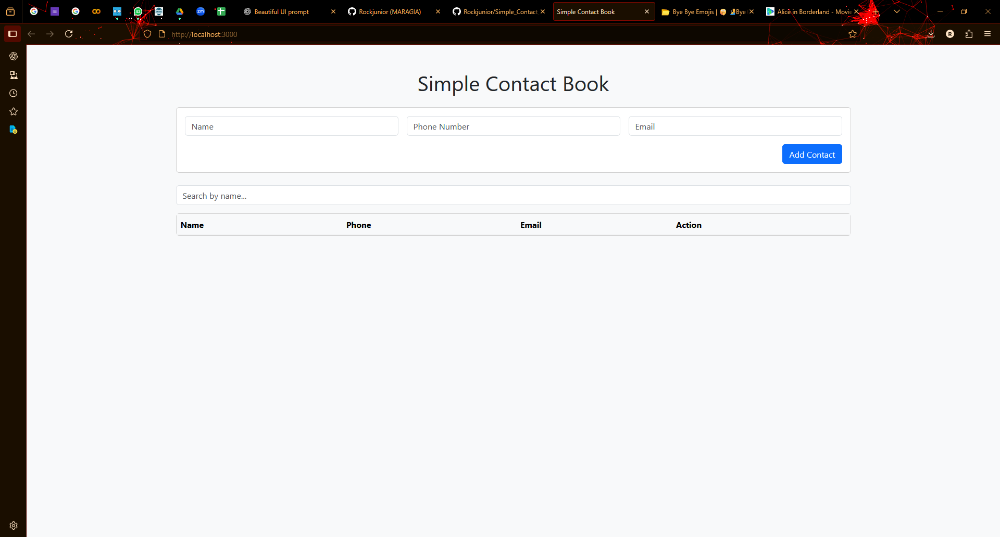
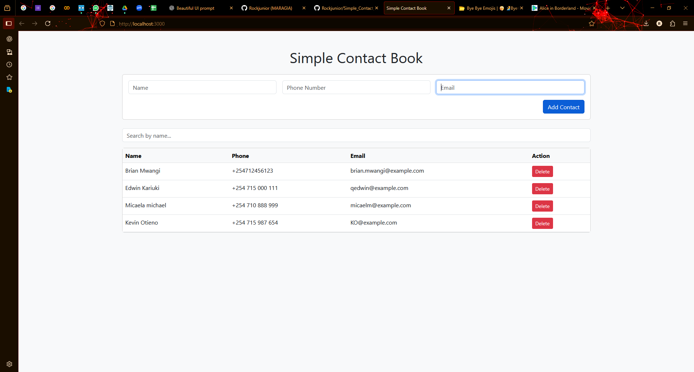
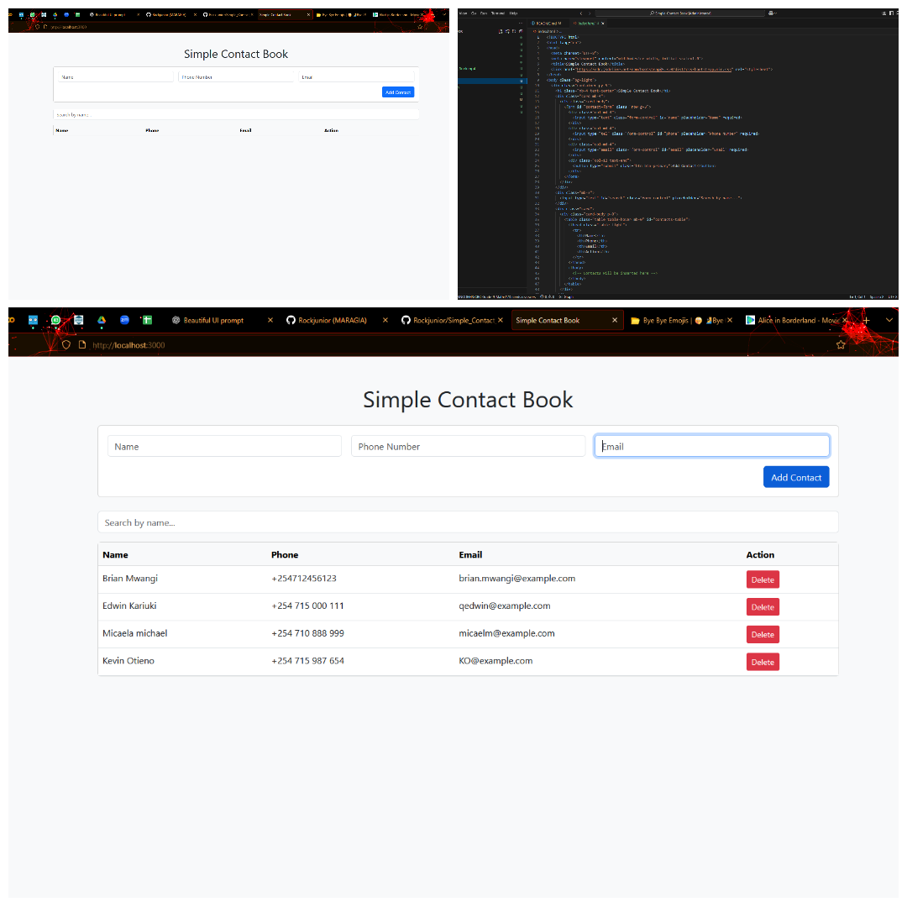

# Simple Contact Book

A modern web app to store, view, search, and delete contacts.

## Features
- Add new contacts (name, phone, email)
- View all contacts
- Search contacts by name
- Delete contacts
- Responsive, modern UI

## Getting Started

### Prerequisites
- [Node.js](https://nodejs.org/) installed

### Installation
1. Install dependencies:
   ```sh
   npm install
   ```

2. Start the server:
   ```sh
   node server.js
   ```

3. Open your browser and go to [http://localhost:3000](http://localhost:3000)

## Usage
- Fill in the form to add a contact.
- Use the search bar to filter contacts by name.
- Click the delete button to remove a contact.

## Images & Video

Here are some screenshots and a demo video showing how the project looks when running:

### Screenshots



### Demo Video
[](video/Simple_Contact_Book.mp4)

## Notes
- Contacts are stored in memory and will reset when the server restarts.

## Disclaimer:

- The names, phone numbers, and email addresses provided in this project were randomly generated by ChatGPT for demonstration purposes only. They are not linked to any real individuals.
- If by coincidence any of these details match real contact information, it is purely accidental. We do not intend to infringe on anyone’s privacy or data rights.
- Please do not use these details for real communication.